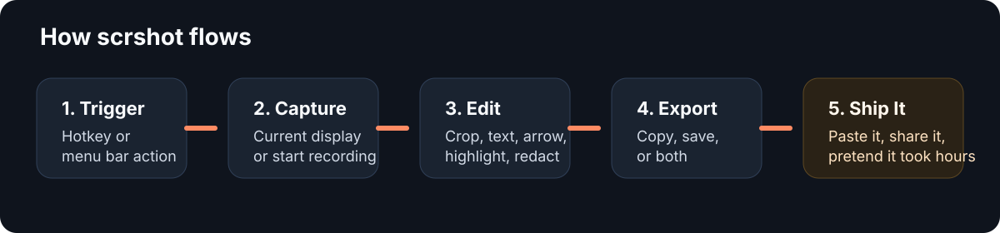
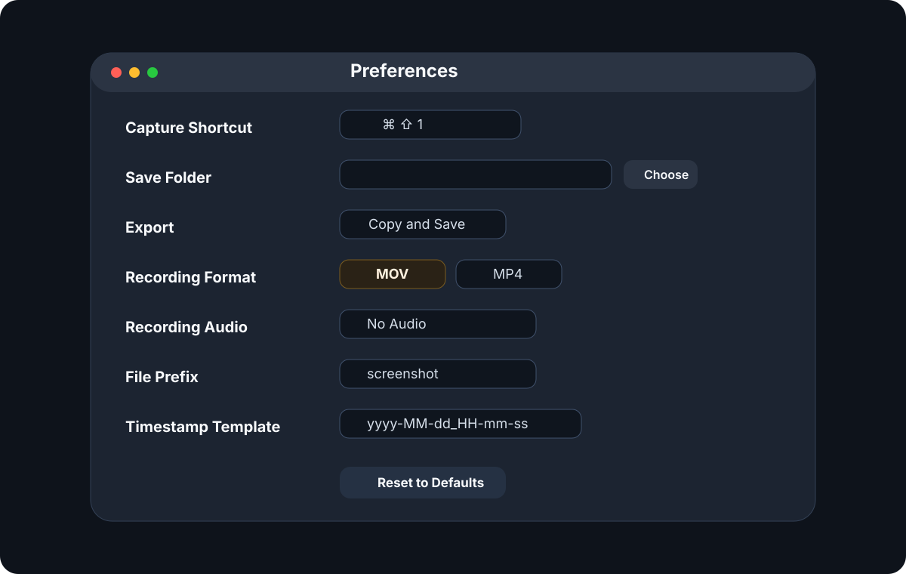

# scrshot

  

  Native macOS screenshots and quick recordings from the menu bar. 
  Built as a lightweight capture tool with a fast edit-and-export workflow.

  
  
  

`scrshot` is a native macOS screenshot utility for people who want a screenshot copied to the clipboard, saved to a folder, and optionally edited right away without extra steps.

## Documentation

- User guide: this `README`
- Technical documentation: [`docs/TECHNICAL_README.md`](docs/TECHNICAL_README.md)

## What It Does

- Captures the display under the current cursor with a global hotkey
- Opens screenshots in a native editor for quick cleanup and annotation
- Exports to clipboard, disk, or both
- Records the current display from the same menu bar app
- Lets you choose recording audio mode directly from the menu bar

## Highlights

- Menu bar app with no Dock clutter
- Global capture hotkey
- Current-display screenshot capture
- Native editor with:
  - crop
  - arrow
  - line with style variants
  - rectangle modes: tint / blur / black
  - text
- Copy, save, or both on export
- Configurable save folder
- Configurable filename prefix and timestamp template
- Video recording from the same app
- Recording audio source toggles from the menu bar
- Recording format selection: `MOV` by default, `MP4` optional
- Launch at login

## Preview

### Workflow

### Preferences

## Screenshot Workflow

1. Trigger capture from the hotkey.
2. `scrshot` captures the display under the current cursor.
3. The image opens in a native editor window.
4. Annotate, crop, highlight, or redact what needs work.
5. Annotate, draw lines, add tinted rectangles, or blur/redact areas.
6. Finish with the result copied, saved, or both.

## Recording Workflow

1. Start recording from the menu bar.
2. Choose audio mode from the menu:
   - `System Audio`
   - `No Audio`
   - `Microphone Only`
   - `System + Microphone`
3. Stop recording from the same menu bar item.
4. The file is saved using your configured format and naming rules.

## Editor Tools

- `Hand`
- `Crop`
- `Arrow`
- `Line`
- `Rectangle`
- `Text`

Rectangle modes:

- `Tint`
- `Blur`
- `Black`

## Export Modes

- `Copy and Save`
- `Copy Only`
- `Save Only`

The default screenshot behavior is `Copy and Save`.

## Compatibility

### macOS Support

- Screenshot capture and editor: `macOS 13+`
- Video recording with native `SCRecordingOutput`: `macOS 15+`
- Microphone capture in recording modes: `macOS 15+`

### Permissions

You will need:

- `Screen Recording` permission for screenshots and video recording
- `Microphone` permission if you choose a microphone-based recording mode

## Installation

### Build in Xcode

1. Open `scrshot.xcodeproj`
2. Select the `scrshot` scheme
3. Pick your development team in `Signing & Capabilities`
4. Build and run

### Download Preview Build

For GitHub-hosted preview builds:

1. Open the latest successful `Release Artifacts` workflow run in `Actions`
2. Download the `scrshot-dmg-<commit>` artifact
3. Open the `.dmg` and drag `scrshot.app` to `Applications`

Tagged release artifacts are signed, notarized, stapled, and Gatekeeper-checked by GitHub Actions when the required Apple secrets are configured. See `docs/GITHUB_SIGNING.md`.

## Default Behavior

### Hotkey

- Default shortcut: `Cmd + Shift + 1`

### Save Location

- Default folder: `~/Documents/Screenshots`

### Recording Defaults

- Audio source: `System Audio`
- File format: `MOV`

## Preferences

You can configure:

- capture shortcut
- save folder
- app theme
- launch at login
- export mode
- filename prefix
- timestamp template
- reveal saved file in Finder
- recording file format

The menu bar also exposes quick recording audio source selection so you do not have to open Preferences every time.
